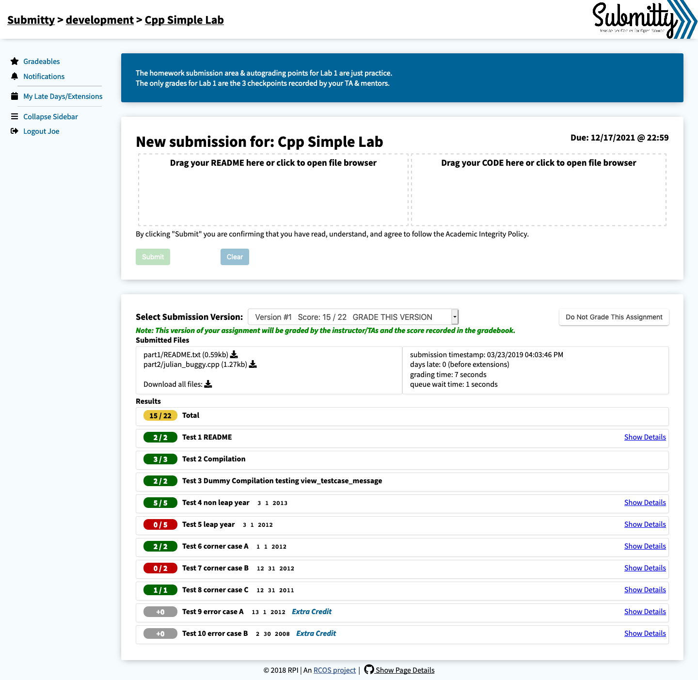

# Submitty

This is the documentation website for [Submitty](http://submitty.org) the RPI Homework Submission Server.

To report issues for this repository, please file them under the [Submitty/Submitty](https://github.com/Submitty/Submitty) repository.

## Developers

Edition was built with [Jekyll](http://jekyllrb.com/) version 3.3.1, but should support newer versions as well.

To use bundler, you first need to have ruby-developer installed. For Linux:

~~~bash
$ apt-get install ruby-dev
~~~
Clone this folder, and enter it in the command line
Install the dependencies with [Bundler](http://bundler.io/):

~~~bash
$ bundle install
~~~

Run `jekyll` commands through Bundler to ensure you're using the right versions:

~~~bash
$ bundle exec jekyll serve
~~~

## Editing

Edition is already optimised for adding, updating and removing documentation pages in CloudCannon.

### Documentation pages

* Add, update or remove a documentation page in the *Documentation* collection.
* Change the category of a documentation page to move it to another section in the navigation.
* Documentation pages are organised in the navigation by category, with URLs based on the path inside the `_docs` folder.

### Change log

* Add, update or remove change log entries from your posts.
* Tag entries as minor or major in the front matter.

### Search

* Add `excluded_in_search: true` to any documentation page's front matter to exclude that page in the search results.

### Navigation

* Change `site.show_full_navigation` to control all or only the current navigation group being open.

# Built with [Edition](https://github.com/CloudCannon/edition-jekyll-template)

Edition is a product documentation theme for Jekyll, see a [live demo](https://long-pig.cloudvent.net/).
Edition was made by [CloudCannon](http://cloudcannon.com/), the Cloud CMS for Jekyll.
Find more templates and themes at [Jekyll Tips](http://jekyll.tips/templates/).
Learn Jekyll with step-by-step tutorials and videos at [Jekyll Tips](http://jekyll.tips/).
