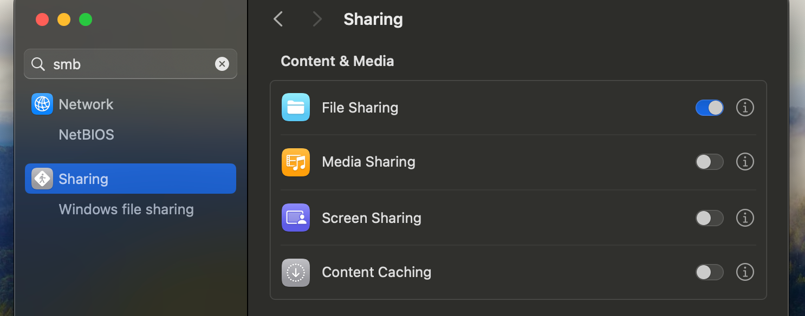

Currently, VirtualBox does not have support for Apple ARM, and the
Vagrant configuration we use does not work on Apple Silicon Macs.
To get around this, you can use an alternate configuration with a
plugin for QEMU virtual machines.

__Note__: These instructions are specifically for Apple Silicon
computers and will not work on any other system regardless of
architecture.

---

## Requirements

1. Make sure you have an Apple Silicon Mac running macOS Monterey
(12.4) or higher.

2. Make sure you have at least 65GB of free space on your disk to
allocate for the virtual machine.

3. The installation process may take upwards of an hour or more.
Make sure your computer is connected to a reliable power source and
stable network, and that it does not go to sleep or hibernate during
the installation process.

---

## Pre-Installation Steps

1. Enable SMB file sharing

   * Open **System Settings** and navigate to **Sharing**
   * Turn on **File Sharing** and go to options
   * Check "Share files and folders using SMB" 
   
   * click on the i button next to the option "File Sharing"
   * Check the box next to your username
   * Click Done

---

## Installation

1. Install [Homebrew](https://brew.sh/)
   ```
   $ /bin/bash -c "$(curl -fsSL https://raw.githubusercontent.com/Homebrew/install/HEAD/install.sh)"
   ```
   Follow the prompts and continue with the installation process.

2. Download and install [Vagrant](https://vagrantup.com/) and [QEMU](https://qemu.org/)
   
   Both of these packages are fairly simple to install with homebrew:
   ```
   $ brew install qemu

   $ brew install --cask vagrant

   $ vagrant plugin install vagrant-timezone

   $ vagrant plugin install vagrant-qemu
   ```
   Note: It is possible that you may need to install Rosetta before installing vagrant. Run the following command to install Rosetta:
   ```
   $ sudo softwareupdate --install-rosetta
   ```

3. Clone and open the Submitty repository

   Navigate to the parent folder you want to clone into and do 
   ```
   $ git clone https://github.com/Submitty/Submitty

   $ cd Submitty
   ```

   **NOTE:** If you are not part of the Submitty organization on
   GitHub, you may want to first
   [fork](https://help.github.com/en/github/getting-started-with-github/fork-a-repo)
   the repository and clone your fork instead, especially if you
   are looking to contribute.
   
   _OPTIONAL: If you will be developing code in one of the companion
   Submitty repositories (e.g., AnalysisTools, Lichen, Localization, RainbowGrades, Tutorial), also
   clone those repositories to the same directory.  For example:_

   ```
   home
   └── myusername
       └── Submitty
           └── GIT_CHECKOUT
               ├── AnalysisTools  (optional)
               ├── Lichen         (optional)
               ├── Localization   (optional)
               ├── RainbowGrades  (optional)
               ├── Submitty
               └── Tutorial       (optional)
   ```

   _This host directory structure will be shared / synced between
   your host operating system and the Submitty virtual machine._

4. Start up Vagrant and provision the machine

   ```
   $ vagrant up --provider=qemu
   ```

   You may be prompted to enter your login username and password
   to mount the SMB files.

   After the machine is provisioned, it will start to run the
   Submitty installation. This process may take upwards of an hour
   or more depending on your internet speed, so ensure your computer
   does not go to sleep during it.

   If the installation process fails due to network issues or is
   interrupted in some way, you may need to delete it and start
   over from the beginning with:
   ```
   $ vagrant destroy
   
   $ vagrant up --provider=qemu
   ```

5. After the `vagrant up` command completes, the VM is started and
   running in the background.

   The VM will continue to run jobs in the background and consume a
   nontrivial amount of CPU resources, while completing a backlog of
   autograding for a dozen or more sample submissions for each of the
   more than 100 users in the sample courses.

   If your development work *will not require sample assignment
   submissions or autograding results*, you may prepend
   `NO_SUBMISSIONS=1` to the previous command, which will skip the
   creation of these sample submissions and their autograding and
   decrease the time to complete installation.

   ```
   $ NO_SUBMISSIONS=1 vagrant up
   ```

6. When the install has completed, you should see the message:
   ```
   #####################################################################

                        INSTALLATION SUCCESS!
   
                           .GGQGGGSlu
                         .GGGGGGGGGGGS
                    :llUGGGGGGGGGGGGGGGG
                    'GGGGGGGGGGGGGGGGGGb        .
                       %GGGGGGGGGGGGGGG~   ..GSGGG
                          GGGGGGGGGGGGGGSGGGGGGGGGG[
                        ;GGGGGGGGGGGGp\ \ \GGGGGGGGL
                       !GGGGGGGGGGGGGGS\ \ \GGGGGG
                       GGGGGGGGGGGGGGGGG\ \ \9GGGG
                       %GGGGGGGGGGGGGGGS/ / /.GGG
                        %GGGGGGGGGGGGGS/ / /GGG
                         '%NNNNNNNNNNNNNNNNNN
   #####################################################################
   ```
   
   *NOTE: There are times when the install will pause for a brief
    period with the message `Done`. This does not mean the install has
    ended, and the install should continue after a bit of time.*


   If you do not see this message due to an error or the installation
   has frozen, check out:

   * [Installation Troubleshooting](/developer/troubleshooting/installation_troubleshooting)

---


## Now you can continue with the regular development instructions...

[Using your Submitty Developer VM](vm_install_using_vagrant#using-your-submitty-developer-vm)
