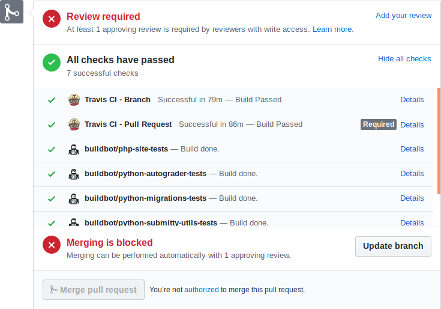

# GSOC 2019 REPORT: Continuous Integration Testing (Automation) for Submitty

 The aim of this project is to expand the code coverage of the unit and integration tests for Submitty codebase.

### Background and Requirements

 From the beginning we observed a couple of problems and chanllenges including :
 1. Travis had become to very suitable for the complex Submitty structure. Which holds code in multiple languages
 2. The times taken to complete builds are/were quite significant for travis.
 3. Submitty code needs more and more tests, i.e we have to increase the code coverage and enforce practices to maintain its growth.
 4. We should be able to get a global view of what the system code coverage, in essence having a single coverage report for all languages.
   
 To achieve this feet, I and my project mentors [Matt Peveller](https://github.com/MasterOdin) and [Barb Cutler](https://github.com/bmcutler) decided on the following work that had to done.

* Find tools that are suitable for Submitty's needs and can replace Travis nicely.
   
  *I found and suggested Buildbot which proved highly suitable for our complex needs*
* Migrate gradually from Travis to this tool (Buildbot).
* Work on issues on the Submitty main repository as a way to complement work being done with configuring an new continues integration framework.

*Since this work is just about architecture we also discussed extensively possibilities of completely having Submitty run on docker and not just the ubuntu VMs which take a lot of time to set up and to do tests when working with.*

### Expectations

As a result, we expected Buildbot, the highly configurable Continues Integration and Automation tool which we could maneuver to get certain not so common task done for us. This include:
 - Move some build and test operations to Buildbot and disable them from Travis at least by the end of GSoC.
 - Run all of significant parts of Travis on docker as part of the Buildbot work but also as an expirement to explore possibilities of using docker as an architecture for Submitty.
 - Reduce bugs on Submitty or introduce new features via open issues and PRs. 

# Results

## 1. Buildbot

In general, I was able to set up and have Builbot run builds on pull requests and also changes to the master branch.

The major things are achieved here are :
- Breakdown and separation of builds, so using thesame concept of build stages distinct sections such as the `migrator`, `site`, and `autograder` where assigned independent Builbot bulders which run more concurrently.
- There's a dramatic increase in the speed of builds. In practise from between 10mins to 2 hours to less than 5 minutes for the parts that were moved.

*A Submitty pull request showing 4 newly introduced builders powered by buildbot*

#### References

* **[Buildbot Set Up Repository](https://github.com/Submitty/submitty-buildbot/)** (Code and Configuration)

* **[Running Buildbot Setup](http://submitty-ci.cs.rpi.edu/)** (Live)

## 2. Submitty PRs

To complement work being done on Buildbot, and also to help me understand the structure of Submitty I had to work on a couple of issues. Most of the work, was related to modifying the python script to improve some aspect of automation.

#### References, major tasks

* Modified python scripts related to generating Sample data for TA notes. [#3885](https://github.com/Submitty/Submitty/pull/3885)
* Added generation of cancelled submissions in sample data. [#3848](https://github.com/Submitty/Submitty/pull/3848)
* Implemented shorchut buttons for the flatpick date picker. [#3963](https://github.com/Submitty/Submitty/pull/3963)
* Fixed stream errors on Forensics page. [#4053](https://github.com/Submitty/Submitty/pull/4053)

Amongts a couple of [other issues](https://github.com/Submitty/Submitty/pulls?utf8=%E2%9C%93&q=+is%3Apr+author%3AFenn-CS+), some of which are yet to be completed.
  

## Future Work

Following various obstacles faced, during the period of GSoC and various areas spotted for improvement there is more work to be done.

For builbot, we agreed to document the work that needs to be done to improve it's functionality based on constraints from my end and limitations of Buildbot itself via the use of open issues. 

#### References

Buildbot Future Work: [Issues tagged [future-work]](https://github.com/Submitty/submitty-buildbot/issues?q=is%3Aissue+is%3Aopen+label%3Afuture-work) 

## Thanks Submitty!

Working with and on Submitty, has been a great experience for me. I was greatly motivated by the "killer" sysadmin and problem solving abilities of my mentor **Matt Peveller** and the highly friendly, supportive and flexible environment created by **Barb Cutler** our GSoC admin.

Many thanks to [Shail Patel](https://github.com/shailpatels), all the GSoC participants and everyone at Submitty.

