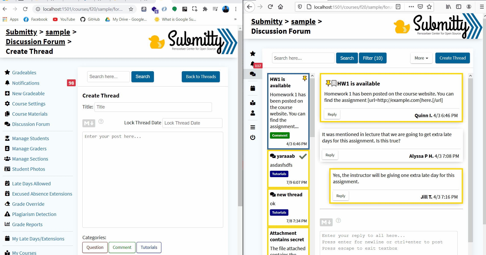
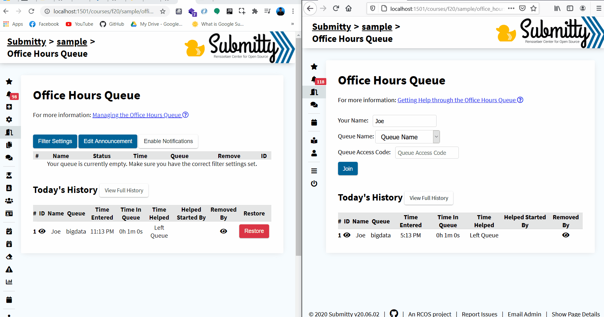
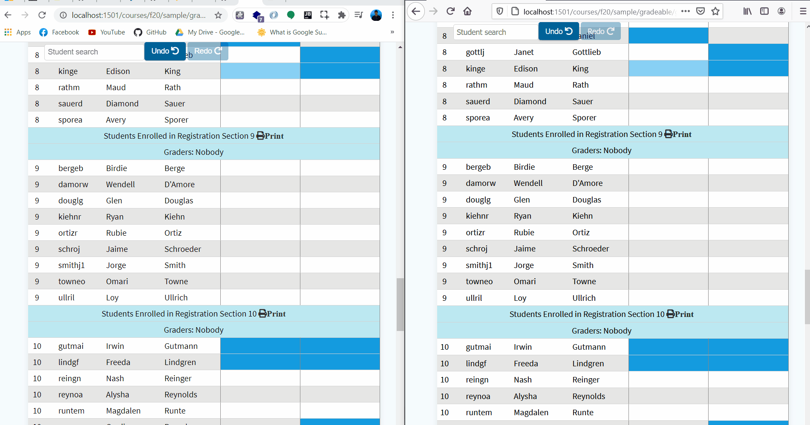

# WebSockets for live page updates

You can find all my merged PRs in [this link](https://github.com/Submitty/Submitty/pulls?q=is%3Apr+author%3Amarwanatef2+is%3Amerged).

---
## Why?
###### Why do we need websockets?

WebSockets allow users' pages to get dynamically refreshed/updated without the need to manually refresh the page every now and then.  
This behaviour is useful in pages that are accessed by multiple users simultaneously. So, new updates are fetched automatically and only the necessary parts of the page are re-rendered without refreshing the whole page to get the updates reducing the load on the server.
 
 ---
## What?
###### Which pages use websockets so far?  

4 pages are currently getting updated using websockets:  

### 1. Discussion Forum

Nearly all forum-related functions use websockets:
* Thread-related: *[#5529](https://github.com/Submitty/Submitty/pull/5529)*
    1. Create new thread
    2. Delete thread
    3. Resolve thread
    4. Announce thread
    5. Merge two threads

* Post-related: *[#5594](https://github.com/Submitty/Submitty/pull/5594)*
    1. Add new post / reply
    2. Modify post
    3. Delete post
    4. Split post
    
In this gif a new thread is created on one user's window and the update is reflected on the other window, new posts are added and thread is marked as resolved.  

### 2. Office Hours Queue

The office hours queue is currently fully working with websockets instead of polling (Check for updates on a time interval of 30 seconds): *[#5660](https://github.com/Submitty/Submitty/pull/5660)*
1. Join / Leave queue
2. Remove student from queue
3. Restore student
4. Add / modify announcement

An example of the office hours queue working with websockets  

### 3. Grade Inquiry

A student can open a grade inquiry for a gradeable if allowed, the grade inquiry is much like the discussion forum and is fully working with websockets as well. *[#5765](https://github.com/Submitty/Submitty/pull/5765)*  
1. Post additional information
2. Respond and resolve inquiry
3. Close / reopen inquiry
4. Add comment

### 4. Checkpoint & Numeric Grading

Both the checkpoint and numeric grading are working with websockets but there is still some area for improvement. *[#5829](https://github.com/Submitty/Submitty/pull/5829)*  

An example for the checkpoint cells updating with websockets  

---
## How?
###### How websockets work?

1. Users open websocket clients when document is ready.
2. User 1 makes a request (eg. *reply to a post*)
3. Upon request success, user's websocket client sends a socket message indicating that there is an update (eg. `{'type': "new_post", 'post_id': #id}`)
4. The websocket server broadcasts / forwards the socket message to all other users (websocket clients) on the same page.
5. Other websocket clients receive the socket message.
6. Upon message receiving users call the associated function depending on the message type mentioned above (eg. `SocketNewPostHandler()`)
7. The associated function makes an Ajax request to fetch the new post and place it in the correct place in the DOM.

#### References

* [WebSocket CLient wrapper](https://github.com/Submitty/Submitty/blob/master/site/public/js/websocket.js) `websocket.js`
* [WebSocket Server](https://github.com/Submitty/Submitty/blob/master/site/app/libraries/socket/Server.php) `Server.php`
* [PHP WebSocket Client](https://github.com/Submitty/Submitty/blob/master/site/app/libraries/socket/Client.php) `Client.php`

For the above explained example:
* [WebSocket initialization function](https://github.com/Submitty/Submitty/blob/master/site/public/js/forum.js#L587-L638) `initSocketClient()`
* [Message sending](https://github.com/Submitty/Submitty/blob/master/site/public/js/forum.js#L203)
* [The message handler (callback function) ](https://github.com/Submitty/Submitty/blob/master/site/public/js/forum.js#L241-L295) `socketNewOrEditPostHandler()`

---
## Future Work

WebSockets open multiple areas for development / improvement including but not limited to:
* **Discussion forum**  
Currently, New posts are added with websockets for *"tree"* view only, posts can be sorted chronologically or alphabetically as well, see issue [*5683*](https://github.com/Submitty/Submitty/issues/5683)

* **Complex Rubric Grading**  
The rubric grading page is accessed by multiple TAs simultaneously, suggestions may be:
    * Update the page when any TA makes any change.
    * Have a small panel at the top indicating all online TAs (having an open websocket client) and colored cursors indicating where or which part (component) they are editing/grading (eg. *Google Docs*)
    
* **Jobs Daemon Queue**

* **Autograding Queue**

* One other functionality that can be added is to send browser notifications on socket messages.

---
## Acknowledgment

I'm very grateful for spending the summer coding with Submitty, I would like to thank **Barb Cutler**, Submitty Admin, for this amazing period and the awesome organizing and her flexibility, I would also like to thank all my mentors **Andrew Aikens**, **Matthew Peveler**, **Kevin McKinney** and **Shail Patel** for their constant guidance and their quick response.  

This summer with Submitty was an unforgettable experience, whenever I'm asked for a recommendation on open source contribution or GSoC Submitty will be the first thing to come to my mind.
