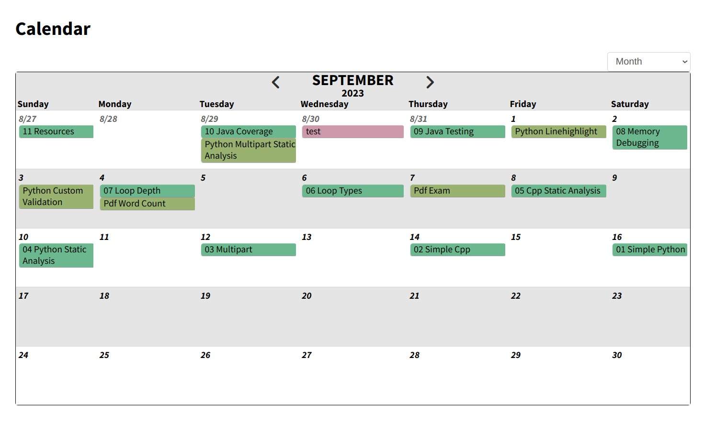
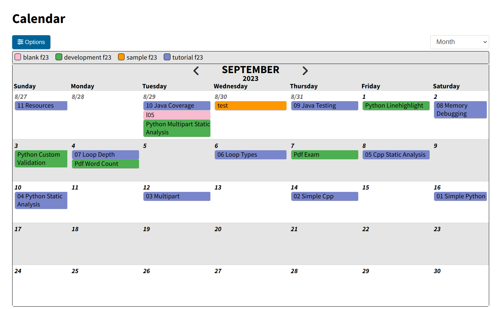
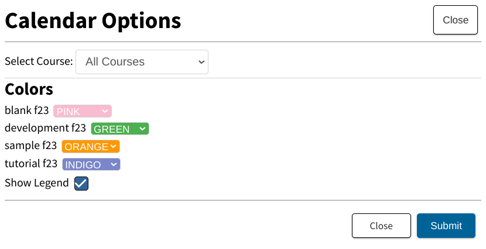

### Summary

My work on Submitty was a great opportunity to sharpen my skills. Due to working on a large codebase and completing incomplete PRs, I improved heavily in reading code and visualizing the systems in my mind. This skill has allowed to me develop far faster than I did at the beginning of the summer, and has refined my debugging skills. I was able to work on several engaging and challenging problems, such as security, calendar overhaul, testing, and more. In addition, I worked with a wonderful team who I could always turn to to ask for help or bounce ideas off of.

### Calendar

My goal was to overhaul the calendar in order to make it more useful to students and instructors.
To that end, I implemented a way to focus on single classes in the calendar, in addition to seeing all at once. After that, I implemented a method to choose colors for each class. To bolster this feature, I also added a legend that
indicated what each color is for, and I chose 16 new colors (8 each for light and dark theme) that met
WAVE's accessibility guidelines for contrast.

**Before**

**After**

#### Future Work

Future features I want to add are:
* Adding course materials to calendar (in progress)
* Coloring by gradeable type (eg. Homework, Exam, etc.)
* Show unreleased gradeables on calendar
* Improved calendar mobile view

### Sample Data

I improved a lot of sample data to keep up with new features and refactors. I added
sample pronouns to users, sample calendar data to assist with future feature testing,
and sample forum data to include markdown. These usually required changing the way sample data is generated
in `setup_sample_courses.py`. For example, for forum data, I needed to make edits that allow posts to have
markdown enabled. For pronouns data, random pronouns needed to be assigned, which also came with the need
to change each test to conform with the new randomly generated data.

### Testing

I implemented and improved several Cypress end to end tests. Prior to the summer, I worked on adding pronouns to
user profiles. This feature was new and untested, so I created a comprehensive test suite for it. Additionally, I 
made tests for autograder test cases, and I finished a PR that ported deprecated Selenium tests to Cypress.

### Notebook Download Security

Notebook gradeables are gradeables that feature problems in formats such as multiple choice, short answer, etc.
These gradeables submitted the results by recording the answer in a `txt` file. The problem with this is that the
`txt` files are visible and downloadable by the students. In most cases, it shouldn't be an issue, but if an instructor
designs the files in a way that can give a hint towards the answer it would be an unfair exploit. I edited `Access.php` to ensure that students wouldn't have permissions for the file. This way, even if students manually entered the url to
get the files, they would be prevented from accessing it.