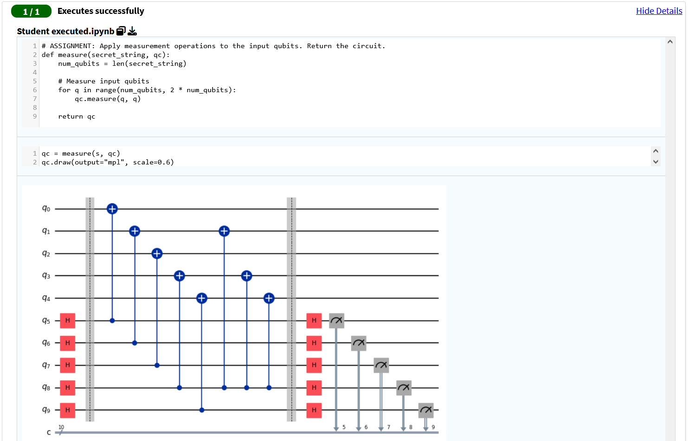
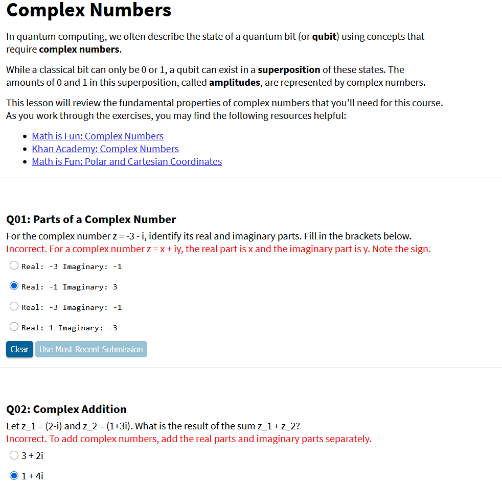
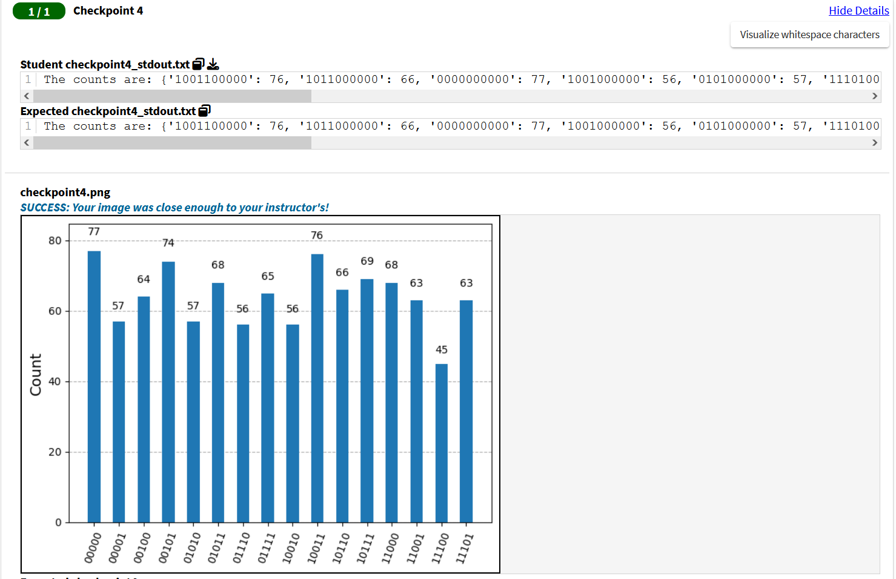
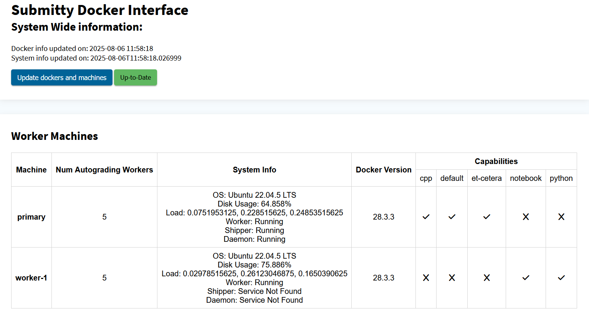
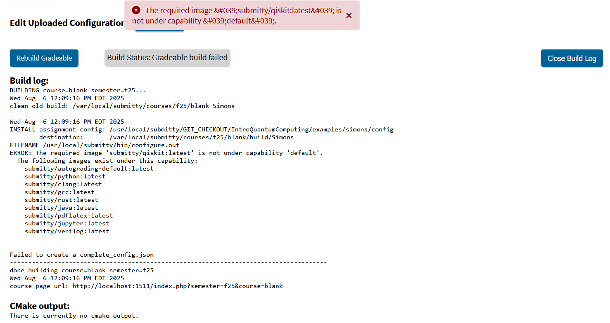
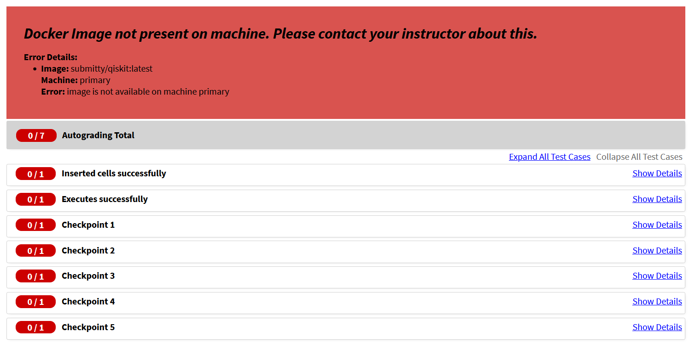

As a first-time Submitty developer, I focused on significantly expanding its quantum computing capabilities and strengthening its core autograding infrastructure. My primary achievement was engineering a secure and robust system for autograding Jupyter Notebooks, a critical feature for modern computational courses. Additionally, I enhanced platform stability and instructor experience by resolving outstanding issues and refactoring key Docker functionalities. My contributions are reflected in over 25 pull requests and more than 20 peer reviews.

### Quantum Computing Integration

This term, I built upon Submitty's existing quantum computing foundation to support more advanced, interactive coursework. I began development of new course content, including a foundational prerequisite course designed to onboard students with the necessary background in linear algebra, complex numbers, and core principles of quantum physics. Building on that, I designed a hands-on lab for Simon's algorithm to demonstrate one of the first known exponential speedups over classical computation. To ensure compatibility with modern tools, I upgraded the Qiskit Docker image to version 2.0.1. I also began work autograding quantum teleportation across a network.

To support this advanced coursework, I engineered a secure autograding pipeline for Jupyter Notebooks ([PR#11736](https://github.com/Submitty/Submitty/pull/11736), [PR#11862](https://github.com/Submitty/Submitty/pull/11862), [PR#11917](https://github.com/Submitty/Submitty/pull/11917)). This feature enables precise grading of individual cells and uses notebook metadata to conceal autograding logic from students. I also integrated in-browser notebook rendering ([PR#11891](https://github.com/Submitty/Submitty/pull/11891)), allowing students to view assignments directly on the platform for feedback.

These improvements strengthen the existing foundation for quantum computing integration within Submitty, while also benefiting other fields that rely on Jupyter Notebooks—particularly data science.

### Autograding & Docker

I took ownership of key improvements to Submitty's containerized autograding infrastructure, with a focus on stability, usability, and maintainability. I shepherded the final stages of a major Docker UI refactor ([PR#11120](https://github.com/Submitty/Submitty/pull/11120)) by resolving lingering bugs, fixing type mismatches, and linting issues. I then contributed several enhancements, including bug fixes and the addition of UI status buttons ([PR#11739](https://github.com/Submitty/Submitty/pull/11739), [PR#11804](https://github.com/Submitty/Submitty/pull/11804), [PR#11883](https://github.com/Submitty/Submitty/pull/11883)).

On the backend, I extended Docker functionality by adding build-time error detection and the ability to remove images by ID ([PR#10839](https://github.com/Submitty/Submitty/pull/10839), [PR#11357](https://github.com/Submitty/Submitty/pull/11357)). Previously, Submitty only supported image removal on the primary machine, resulting in wasted storage on worker machines where images were left behind. I resolved this by extending image removal support to worker machines ([PR#11812](https://github.com/Submitty/Submitty/pull/11812)), updating Cypress tests as needed. To improve reliability, I fixed critical bugs across the container system and improved error messaging for developers and instructors ([PR#9710](https://github.com/Submitty/Submitty/pull/9710), [PR#11697](https://github.com/Submitty/Submitty/pull/11697), [PR#11717](https://github.com/Submitty/Submitty/pull/11717), [PR#11744](https://github.com/Submitty/Submitty/pull/11744)).

### Miscellaneous & Future Work

In addition to working on integrating quantum computing with Submitty, I contributed to a range of platform improvements and participated in code reviews to maintain project quality.

Next steps for quantum computing integration include:

- Expanding both prerequisite course content and prospective course labs and homeworks
- Embedding Jupyter autograding natively into Submitty (removing reliance on scripts)
- Enabling student quantum circuits to run via a Submitty-managed IBM Quantum account