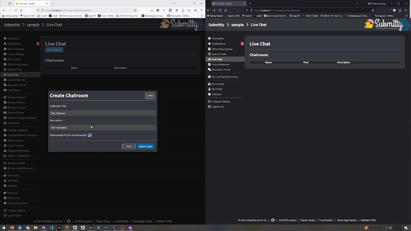
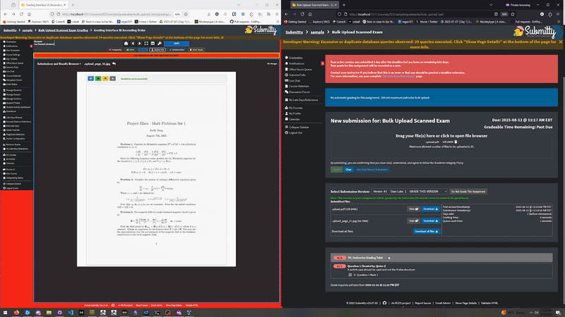

This summer I primarily worked on two new Submitty features, live chat and image annotation.

## Live Chat

Going into the summer, [Live Chat](https://github.com/Submitty/Submitty/pull/10214) was functional but needed security updates and some style fixes, so the first thing I did when starting work on Submitty was move the websocket from the client to the server, updated the style of the Live Chat, and added websocket chatroom enables and disables:

Additionally, I wrote [end to end tests](https://github.com/Submitty/Submitty/pull/11818) for the new feature, including a proof of concept for end to end websocket testing using Cypress, which we previously thought might require a different testing library. This was done with the immense help of [Jeffrey Cordero](/developer/rensselaer_center_for_open_source/2025_Jeffrey_Cordero) who implemented this new testing pattern for many other features this summer.

## Image Annotation

During the summer one of our group's main goals was to get the number of open pull requests down to 0 by the end of the summer. One large thing preventing that were our open dependency PRs, one of which was a [double dependency of PDF annotator and PDF rendering](https://github.com/Submitty/Submitty/pull/11013). While I was able to update the PDF rendering dependency with some help from the other members we were unable to update our PDF annotator dependency because the package was maintained solely by Submitty, and wasn't even working in its most recent release. That realization led to the decision to remove the PDF annotation feature in favor of an image annotation feature. This coincided well with the addition of bulk upload, which turns large PDFs into a series of images. The idea is that in the future we'll stitch these images back together into a PDF-like format. As part of that I wrote a new [image annotation](https://github.com/Submitty/Submitty/pull/11921) implementation using a library [markerJS](https://markerjs.com/) which works really well as a plug-and-play solution to the problem. The relative age of our tech stack made this a little more difficult but I was eventually able to implement image annotation:

## Urgent Bugfixes

I made two urgent fixes to our i[nstall site script](https://github.com/Submitty/Submitty/pull/11854) and [course materials](https://github.com/Submitty/Submitty/pull/11909). The install site script had been broken inadvertently by changes to our overall install script, and I was able to fix the script with the help of my peers. The course materials bug was a bug that was discovered this summer but had existed previously, we investigated the cause of the bug and I was able to identify and fix it, along with fixing a lot of other related bugs in course materials, meaning that the feature will be more stable and predictable than it was previously. Not only is bugged input prevented, but it also should fail more gracefully if bugged input is somehow accepted.

## Other to Mention

Finally, I helped draft out [first PR autoreply](https://github.com/Submitty/Submitty/pull/11597) script/text, which allows us to more efficiently interact with new developers.