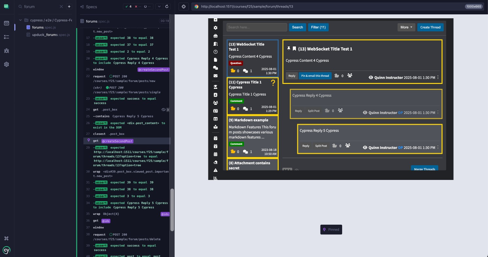
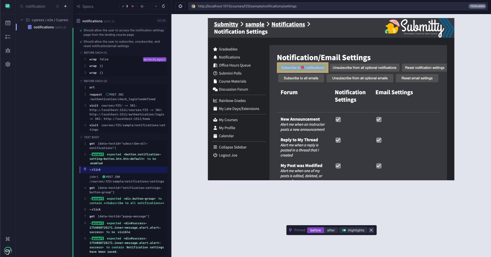
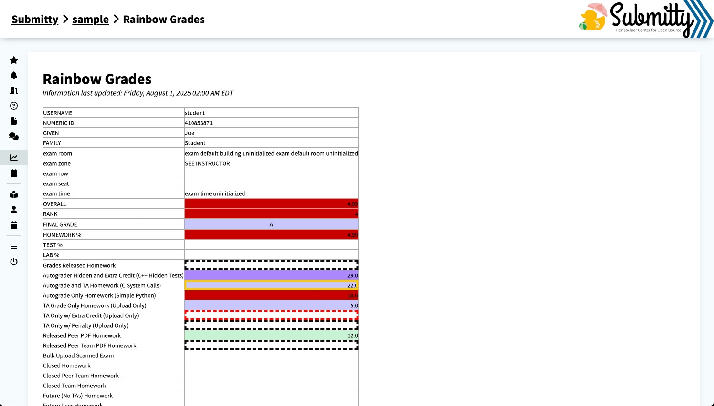

During my time this summer with Submitty, I contributed to the large-scale open-source academic platform, focusing on full-stack development, infrastructure modernization, and system security. This experience deepened my technical skills across frontend and backend technologies while expanding my understanding of systems design, type safety, and automated testing.

Beyond implementation work, I gained valuable experience in collaborative development by engaging in design discussions, reviewing code at scale, and helping shape practices that prioritize maintainability and reliability. These efforts strengthened my ability to think critically about long-term engineering impact in a complex, highly impactful codebase. The following sections highlight some of the most rewarding features I had the opportunity to work on this summer.

### WebSocket Security & Testing

I addressed a critical security flaw in the platform's WebSocket server by implementing a token-based authorization system ([#11634](https://github.com/Submitty/Submitty/pull/11634)). Previously, any user with a direct URL and valid login credentials could access any WebSocket page, posing a considerable risk for real-time student-instructor communications.

To resolve this, I designed a JSON Web Token (JWT)–based authorization layer, where the web server now generates short-lived, multi-use tokens scoped to specific pages. Each token ensures that WebSocket connections are established by authorized users, with permissions managed using a sliding window mechanism to handle expired pages. This approach cut the average WebSocket connection authentication time by approximately 90%.

```json
{
  "iat": 1753797357.504631,
  "iss": "https://submitty.org/",
  "sub": "instructor",
  "authorized_pages": {
    "f25-sample-defaults": 1753800957,
    "f25-sample-chatrooms-1": 1753800957,
    "f25-sample-polls-3-instructor": 1753800912
  },
  "expire_time": 1753800957
}
```

In parallel, I introduced the first end-to-end test suite for WebSockets in the Discussion Forum ([#11873](https://github.com/Submitty/Submitty/pull/11873)). I expanded this with a comprehensive testing strategy that included PHP unit tests for backend logic and updates to Cypress tests to verify authorization-based WebSocket connections.

<div style="text-align: center; max-width: 100%; margin: auto;">
  
</div>


### Notification System Enhancements

To improve student communication, I implemented significant enhancements to the platform’s notification system, including automatically alerting students via in-platform notifications and email when grades are released ([#10358](https://github.com/Submitty/Submitty/pull/10358)) or when new assignments become available ([#11897](https://github.com/Submitty/Submitty/pull/11897)). These notifications are delivered by a reliable, hourly cron job that dispatches pending messages across all active courses.

```
[Submitty sample] Grade Released: Grading Homework PDF
Your grade is now available for Grades Released Homework in course
SAMPLE.

Click here for more info: http://localhost:1511/courses/s25/sample/gradeable/grading_homework_pdf

--
NOTE: This is an automated email notification, which is unable to receive replies.
Please refer to the course syllabus for contact information for your teaching staff.
Update your email notification settings for this course here: http://localhost:1511/courses/s25/sample/notifications/settings
```

To support these improvements, I also built dedicated Cypress test suites for email delivery ([#11878](https://github.com/Submitty/Submitty/pull/11878)) and user notification preferences ([#11913](https://github.com/Submitty/Submitty/pull/11913)). These tests validate key user flows, such as editing preferences and verifying delivery status, laying the groundwork for future testing around user communications.

<div style="text-align: center; max-width: 100%; margin: auto;">
  
</div>

### Rainbow Grades Nightly Build

Previously, the Rainbow Grades summary page could become outdated unless instructors manually triggered a rebuild. To streamline this process, I enhanced the nightly summary generation script to automatically update the instructor customization file and submit the build process before generating new summaries ([#11496](https://github.com/Submitty/Submitty/pull/11496)), ensuring students now have continuous access to the most up-to-date grade reports.

```bash
$ python3 sbin/generate_grade_summaries.py f25 sample submitty_daemon
Successfully selected the manual customization for f25.sample
Successfully submitted the Rainbow Grades build process for f25.sample
Successfully completed the Rainbow Grades build process for f25.sample - {'status': 'success', 'data': '...'}
Successfully generated grade summaries for f25.sample
```

<div style="text-align: center; max-width: 100%; margin: auto;">
  
</div>
