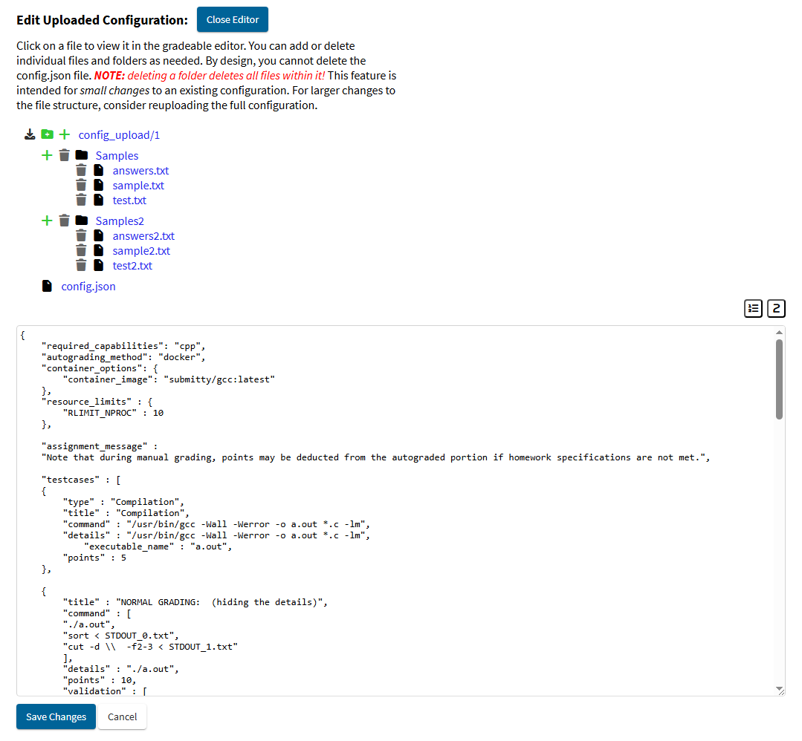

[View my commits](https://github.com/Submitty/Submitty/commits?author=JManion32)

**51** pull requests reviewed  
**26** pull requests created  
**17** pull requests taken over and merged

Spending Summer 2025 as a full time Submitty developer was a unique and incredibly rewarding experience! Here are some of the features I worked on:
### Displaying all Notifications on the Home Page
[PR#11914](https://github.com/Submitty/Submitty/pull/11914)  
Submitty previously only displayed notifications on a per-course basis, meaning users had to visit each individual course to view or mark notifications as read. As we’ve added more advanced notification features, this limitation became increasingly cumbersome, especially for users in multiple courses. On top of that, the home page itself felt bare, with lots of unused space.

**Design Process**  
Since this feature is now front and center on the site, thoughtful UI/UX design was essential. We started with whiteboard sketches to explore layout ideas, then moved to Figma to create a polished mockup for feedback and iteration. Throughout development, I regularly demoed progress to the group to gather input and refine both functionality and design.

**Technical Challenges**  
The main challenge was efficiently aggregating notifications from multiple course databases. Since each course requires its own query and this feature now runs every time a user visits the home page, performance was crucial. To address this, I optimized the process by:
- Limiting queries to only active courses
- Limiting each query to the 10 most recent notifications
- Sorting results server-side for efficiency
- Creating a new database index on `created_at` and `to_user_id`, reducing the time complexity from **O(courses × notifications)** to **O(courses)**

This update not only streamlines how users interact with notifications, but also transforms the homepage into a more dynamic and informative landing experience. Looking ahead, I hope to expand this space further by adding upcoming gradeables, grade summaries, and other personalized insights to evolve the homepage into a true dashboard.

### Gradeable Configuration Text Editor
Historically, editing a gradeable’s configuration in Submitty required switching to a different server directory, uploading a full config bundle, or using the limited Notebook Builder tool. There was no support for directly editing config.json or supplemental files from the web interface.

**Gradeable Config Editor ([PR#10325](https://github.com/Submitty/Submitty/pull/10325))**  - I inherited this PR from [Tate Whiteberg](https://github.com/DarthNyan) and completed the implementation of the initial text editor for editing gradeable configuration files.

**Live Editing with CodeMirror ([PR#11814](https://github.com/Submitty/Submitty/pull/11814))** -
Rather than just using a basic text area, I implemented Code Mirror to allow for a more customizable experience, and native tab support.

**File & Folder Management ([PR#11860](https://github.com/Submitty/Submitty/pull/11860))** -
Added UI components to allow adding and deleting files from the gradeable configuration.

**Customizable Environment ([PR#11924](https://github.com/Submitty/Submitty/pull/11924))** - 
Added toggles for line numbers and tab size.

**Download Config as ZIP ([PR#11973](https://github.com/Submitty/Submitty/pull/11973))** -
Added the ability to download the entire config directory as a ZIP archive for backup or transfer. This allows users to save edits they made on the site editor for future use.

**Design & UX Polish ([PR#11991](https://github.com/Submitty/Submitty/pull/11991) and [PR#12003](https://github.com/Submitty/Submitty/pull/12003))** - 
Refined visual layout and interactions to feel intuitive and consistent with the rest of Submitty. Changes include highlighting selected files, adding tool tips to the customize toggles, making switch between text files smooth, ensuring correct file order (root-level directories first, then root-level files), and improving overall spacing.

**Edit Directory File (PR pending)** - 
Allows users who pull from Submitty's private autograding directory to use the gradeable config editor.

**Directory Editing Permission Controls (PR pending)** - 
Before I can create the above PR, there is a security vulnerability that needs to be addressed. Currently, there are no checks to ensure that the user pulling from the repository owns the file. This means that anyone with SSH access would be able to edit any autograding configuration (even live ones!).

### Dark Mode Toggle for the Documentation Site
[PR#691](https://github.com/Submitty/submitty.github.io/pull/691)  
To improve accessibility and match user expectations, I added a dark mode toggle to the Submitty documentation site. The site is built with Jekyll and uses auto-generated styles, so integrating theme switching required working around those constraints.

**Implementation:**  
- **SCSS Theming** – Introduced a dedicated `_colors.scss` file to define color variables for both light and dark themes. These variables are applied across components to ensure consistency and maintainability.
- **Style Overrides** – Since the site uses a mix of default and third-party CSS, I selectively overrode conflicting styles via `dark_mode.css` to support dark mode without breaking layout or readability.
- **JavaScript Toggle** – Implemented a lightweight JS toggle that saves user preference and dynamically applies the appropriate theme class.
- **Responsive Design** – Tested and refined the toggle to ensure it works seamlessly across devices, including mobile. All elements have a `0.2s` transition time for a smooth, polished theme change.

### Additional Work:
**Filter Withdrawn Students**  
[PR#11792](https://github.com/Submitty/submitty.github.io/pull/11792)  
Initially created by GitHub user [yanliw123](https://github.com/yanliw123). To streamline grading, this PR adds a toggle that hides withdrawn students from the grading page, so TAs can focus only on active students.

**Add Audit / Withdrawn to Sample Data**  
[PR#11882](https://github.com/Submitty/submitty.github.io/pull/11882)  
Added two students with registration_type set to `withdrawn` and two with `audit` to the existing sample data, which uses a seeded random number generator. Modifying this data shifted all related values, requiring updates to 25+ Cypress test files to ensure the feature integrated seamlessly.

**Team Grade Override**  
[PR#10677](https://github.com/Submitty/submitty.github.io/pull/10677)  
Initially created by [Michael Papadopoulos](https://submitty.org/developer/rensselaer_center_for_open_source/2024_Michael_Papadopoulos). When overriding a grade in a team gradeable, instructors would have to process each student individually. Now, a popup listing the student’s teammates displays, notifying the instructor that they have teammates, and asking if they want to override them as well.

### Reflection
This summer significantly expanded my skill set as a developer, with clear progress reflected in my pull requests. What began as simple frontend styling tweaks quickly grew into the implementation of complex, full-stack features spanning multiple layers of the system. I’m excited to keep pushing my skills further and exploring new challenges ahead!

Working on Submitty felt a lot like being part of a fast-moving startup, where everyone contributes meaningfully, pushes large commits daily, and solves real problems that impact real users. I genuinely believe this experience has been just as valuable as, if not more than, a traditional internship. The open source nature of the project meant that I got out of it what I put in. I’m proud of what I’ve built this summer, and more importantly, I feel prepared to take on real-world engineering challenges.

### Future Plans for Submitty
I am planning to work on Submitty in Fall 2025 and Spring 2026 (and beyond!). Here are some features I am interested in adding:

- **Enhance the Autograding page** – A vital tool for instructors; improving it means a better experience for everyone.  
- **Transform the home page into a dashboard** – Centralize key info like upcoming gradeables and grade summaries, reducing the need to jump between courses.  
- **Refactor and modularize `forum.js`** – The forum is a favorite feature but trapped in a single 3,000-line file. Breaking it up will make it cleaner, faster, and easier to improve.  
- **Improve site intuitiveness and maintainability** – Tackle tech debt with cleaner CSS, fewer inline scripts, smaller files, and stronger testing, making the platform friendlier for all developers.  
- **Convert pages to Vue** – The component-based approach is a joy to work with and a strong candidate to become a core part of the stack.  
- **Deepen database integration** – Excited to apply upcoming coursework to build smarter, more efficient database features.  
- **Explore WebSockets** – Real-time features could level up many parts of Submitty, and I’m eager to dive in.  

Overall, this summer has been an invaluable experience in my journey to becoming a software developer. I would like to thank Professor Cutler, my teammates, and RPI for making this happen. I’m so proud of all that we accomplished and excited to see what we create next!
