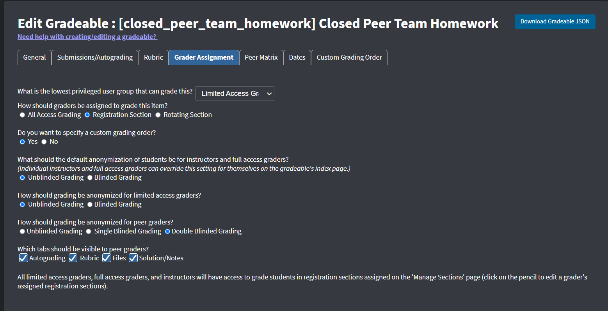
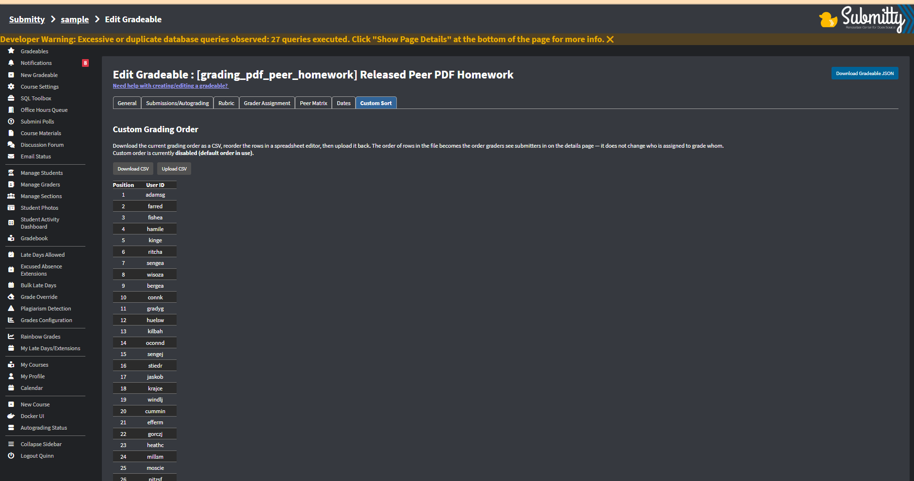
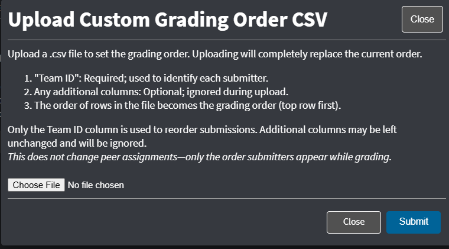
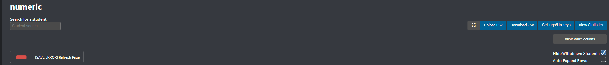
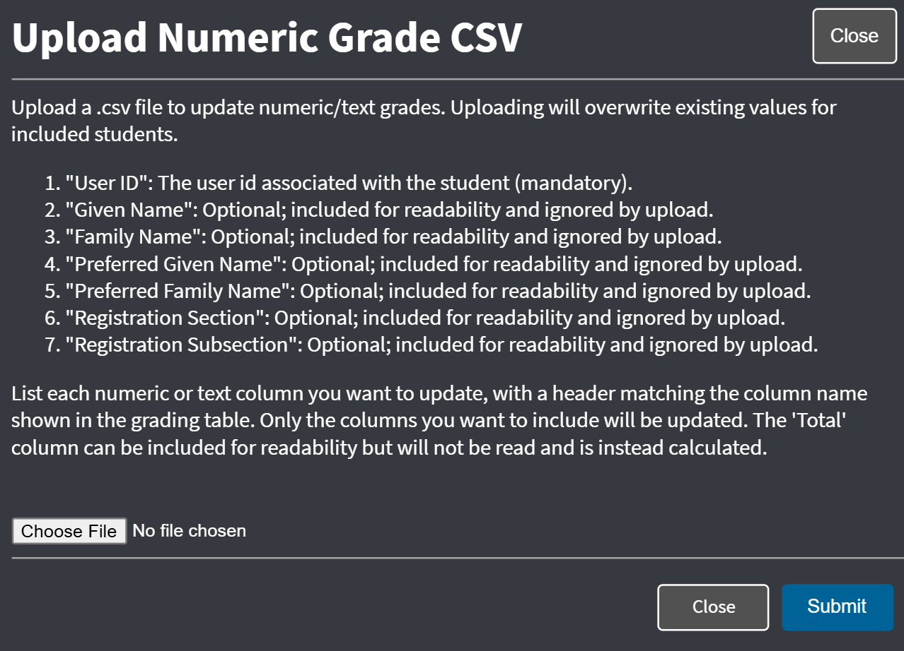
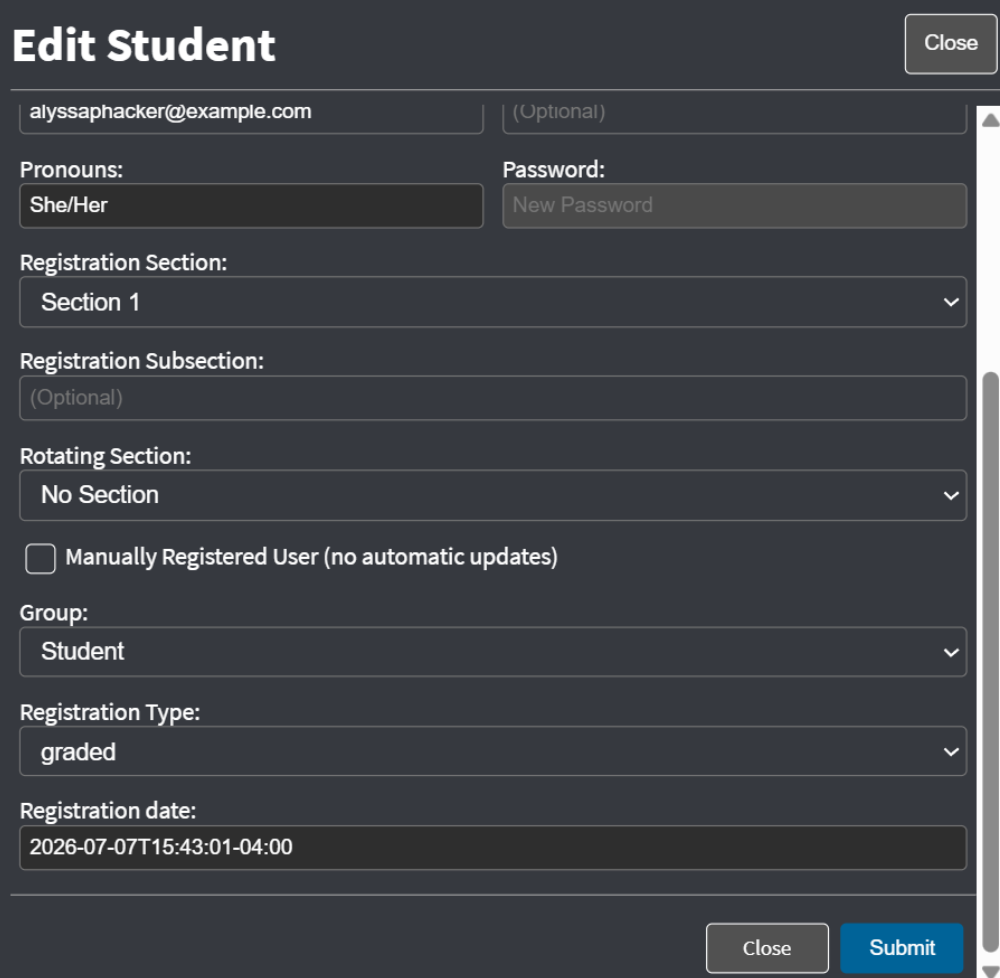
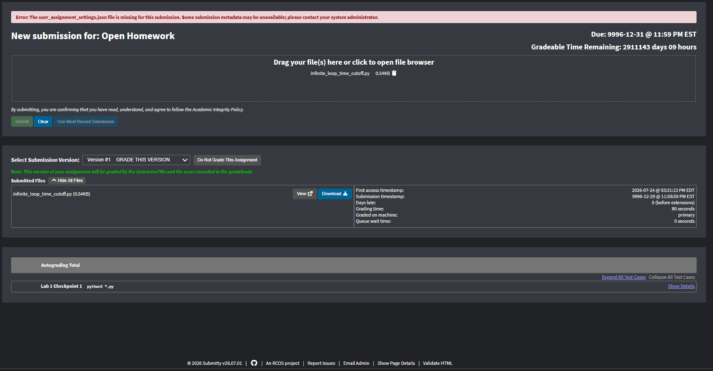

Spending the Summer of 2026 as a member of the Submitty team was an incredible experience that helped me grow both as a developer and as a collaborator. 
Here are a few highlights from my summer:

**[53 pull requests reviewed](https://github.com/Submitty/Submitty/pulls?q=is%3Apr+reviewed-by%3Adandrecollins07-ctrl+created%3A%3C%3D2026-08-07)**  
**[15 pull requests created](https://github.com/Submitty/Submitty/pulls?q=is%3Apr+author%3Adandrecollins07-ctrl+created%3A%3C%3D2026-08-07)**

## Custom Grading Sort

**Pull Request:** [#13123](https://github.com/Submitty/Submitty/pull/13123)

Peer grading continues to expand and grow through Submitty, planning to be used more often. I wanted to contribute to a significant feature.

My contributions included:

Implementing a complete custom grading workflow for instructors. This feature included:

- Added a database migration to store custom grading order.
- Implemented backend support for saving and retrieving custom sort order.
- Added instructor UI for enabling custom sorting.
- Implemented CSV download and upload support.
- Added validation and default behavior.
- Tested both individual and team gradeables.

The feature supports both individual and team gradeables.

 

## Numeric Gradeable CSV Import and Export
**Pull Requests:** [#12995](https://github.com/Submitty/Submitty/pull/12995), [#12998](https://github.com/Submitty/Submitty/pull/12998)

Managing grades for large courses often requires instructors to work with spreadsheets. Before these changes, instructors would only be able to upload a CSV but they could not download one. I was assigned to revamp the upload to reflect more modern format, along with add the download feature.

The completed workflow allows instructors to download grading data, edit it in a spreadsheet, and upload the updated information back into Submitty. This reduces repetitive manual edits and makes managing large numeric gradeables more efficient.
 
## Registration Date
**Pull Request:** [#13101](https://github.com/Submitty/Submitty/pull/13101)

Instructors previously could not to see when a student registered for a course. This made it more difficult to verify if students joined a course or investigate enrollment related questions. I implemented support for storing and displaying each student's registration date within the instructor interface.

## Missing Assignment Settings Warning
**Pull Request:** [#13089](https://github.com/Submitty/Submitty/pull/13089)

The TA grading interface relied on a `user_assignment_settings.json` file to display submission metadata. When this file was missing or unreadable, Submitty continued to display it in the Files panel without explaining why it could not be opened. 

My contributions included:

- Added a warning banner when `user_assignment_settings.json` is missing.
- Removed the missing file from the Files panel to prevent broken links.
- Extended the warning to handle unreadable files caused by incorrect file permissions.
- Added the same warning to the student submission page for a consistent experience.
- Updated the implementation based on reviewer feedback and tested several failure scenarios.

During code review, I expanded the feature beyond the original bug report. Reviewer feedback identified additional edge cases involving unreadable files and missing warnings on the student side. I updated the implementation to cover these scenarios before the feature was merged.

The completed feature gives instructors and students clear feedback when submission metadata is unavailable instead of silently failing. This makes debugging submission issues easier and improves the overall grading experience.

## Other Contributions

In addition to the projects above, I worked on several smaller features, bug fixes, and testing improvements across Submitty.

- [#13153](https://github.com/Submitty/Submitty/pull/13153) fixed the Peer Matrix popup so it appeared correctly without requiring a page refresh.
- [#13084](https://github.com/Submitty/Submitty/pull/13084) added Cypress coverage for the peer grading panel.
- [#13066](https://github.com/Submitty/Submitty/pull/13066) fixed median and count calculations in the grading interface.
- [#12938](https://github.com/Submitty/Submitty/pull/12938) improved the submission file list by allowing it to collapse.
- [#12924](https://github.com/Submitty/Submitty/pull/12924) fixed support for uploading dot files.
- [#12191](https://github.com/Submitty/Submitty/pull/12191) fixed an issue with the submission download button.

## Reflection

My summer with Submitty was a valuable learning experience. I started the summer knowing I still had a lot to learn, which made the first few weeks both exciting and challenging. Every project introduced something new, whether it was working in a large codebase, learning unfamiliar technologies, or debugging features across multiple parts of the application.

Working on an open source project also taught me the value of collaboration. Code reviews, team discussions, and daily feedback helped me improve as a developer. As the summer progressed, I became more confident in navigating the codebase, adapting to new technologies, and solving problems independently.

This experience strengthened both my technical skills and my ability to work as part of a development team. It gave me a better understanding of the software development process, from implementing new features to testing, debugging, and refining code through review.

## Future Plans

I will continue to contribute to Submitty in the Fall. I hope to expand my knowledge, work on new and old fixes, and provide assistance to those new to Submitty.