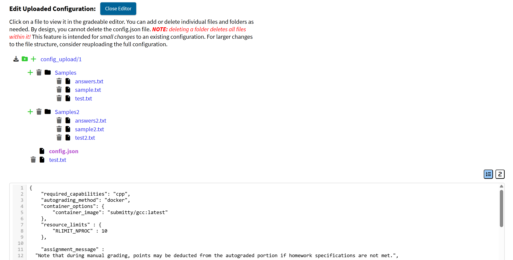

The Gradeable Autograding Configuration Text Editor allows instructors to quickly view and make minor adjustments to a gradeable’s autograding configuration directly on the site. It can be found below the [autograding upload section](https://submitty.org/instructor/assignment_configuration/configuration_path) on the `Submissions / Autograding` page within a gradeable’s settings.

### Features

#### Adding Directories & Files
You can add new directories to the root level, and add individual files either to the root level or within existing folders. If you need to add a folder that already contains files, consider re-uploading the configuration instead.

#### Removing Directories & Files

You can delete individual files or entire directories from the configuration as needed. **_Note: Deleting a directory will also remove all of its contents!_** By design, you cannot delete the entire configuration or the `config.json` file.

#### Downloading Configuration
Download a ZIP file of your current configuration by clicking the download icon next to the folder. This download button is also next to the configuration on the autograding upload page.

#### Customizing the Editor
The text editor uses CodeMirror to enhance the editing experience. Use the buttons in the top-right corner of the text editor to:
1. Toggle line number visibility.
2. Switch the tab size between 2 and 4 spaces.

---

_Note: This feature is only available for uploaded configurations. It does not yet support configurations pulled from the private courses repository._